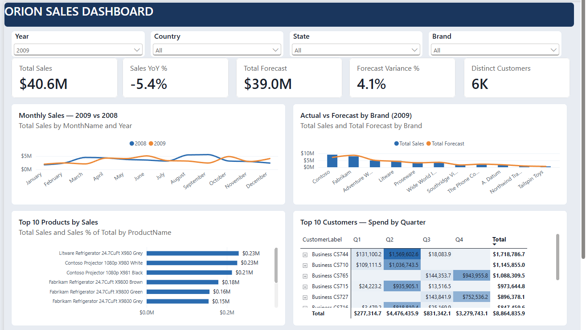

# Orion Sales Analytics

Technical assessment for the Data Analytics Solutions Engineer role.

I built an ETL pipeline in Python that turns two unstructured JSON files into a
relational star schema, then used that output to build a data model and a
single-page dashboard in Power BI.



The source data covers 1 January 2008 to 31 December 2009: 298,246 sales
records (178 MB) and 33 forecast records. Total revenue across both years is
$83,535,101.76. The whole pipeline runs in about 30 seconds.

## Deliverables

| asked for | where it is |
|---|---|
| Python ETL script | `etl/etl_pipeline.py` |
| Structured data outputs / sample database | `output/` : 9 CSV tables, `orion_sales.db`, `schema.sql` |
| Data model | `output/schema.sql` for the relational model, and the star schema inside the `.pbix`. Explained in [the data model](#the-data-model) below |
| Power BI dashboard | `Orion Sales Dashboard.pbix` |
| Documentation of ETL logic, model and assumptions | this file |

If you only read one section, read [what I found in the data](#what-i-found-in-the-data).
Four of the six findings changed the numbers, and one of them would have
deleted $41M of real revenue if I had got it wrong.

## Running it

```bash
pip install pandas
python etl/etl_pipeline.py
```

Everything is written to `output/`, and the script prints a validation report at
the end. It is safe to run more than once, since it drops and rebuilds its own
output each time.

To query the database:

```python
import sqlite3, pandas as pd
conn = sqlite3.connect("output/orion_sales.db")
pd.read_sql("""
    SELECT d.Year, ROUND(SUM(f.SalesAmount), 2) AS sales
    FROM fact_sales f JOIN dim_date d ON f.OrderDate = d.Date
    GROUP BY d.Year
""", conn)
```

## What is in the repo

```
etl/etl_pipeline.py     the pipeline
exploration/            the profiling scripts I used to find the problems
output/                 9 CSV tables, a SQLite database, schema.sql
Orion Sales Dashboard.pbix
```

`data/` is not committed. `Sales.json` is 178 MB, which is over GitHub's 100 MB
file limit. I have also left out the assessment brief itself, since it is
Orion's document rather than mine to publish.

The `exploration/` folder is not a deliverable, but I have kept it in because it
shows how I arrived at each cleaning decision. Every number quoted below comes
out of one of those scripts.

---

## What I found in the data

I profiled the file before writing any of the pipeline. Six things came out of
that, and all of them changed what the ETL does.

### `Color` does not contain colours

I compared the two columns row by row:

```
Color == Subcategory : 298,246 of 298,246 rows (100%)
```

All 32 distinct values are subcategory names like "Laptops", "Microwaves" and
"Washers & Dryers". There is not one real colour in the column, so I dropped it.
If I had left it in, someone would eventually have built a "sales by colour"
chart that looked fine and meant nothing.

Actual colours do exist in the data, but they are at the end of the product name
("...E110 White"). Pulling them out with a regex would be a sensible next step.

### The missing customer data is not missing at random

`Name`, `Education` and `Occupation` are null on 268,449 of 298,246 rows, which
is 90%. My first instinct was `fillna("Unknown")`. Before doing that I checked
the pattern per customer, and it turned out to be all or nothing:

| | customers |
|---|---|
| attributes on every row | 8,609 |
| attributes on no row | 259 |
| partly filled | 0 |

Not a single customer is partly filled. That rules out sparse data entry, and
means there is nothing to recover by back-filling. So the nulls are not damage,
they are marking something.

### The 259 nameless customers are business accounts

They are 2.9% of customers but 90% of records and 87% of revenue. Average
revenue is $281,643 each, against $1,230 for a named customer, which is 229
times higher.

Four separate things point the same way, with no exceptions in either group:

| | individuals | the other group |
|---|---|---|
| name, education, occupation | always present | never present |
| CustomerKey range | 13 to 18,482 | 18,766 to 19,143 |
| Customer Code format | digits, e.g. `11012` | `CS` + digits, e.g. `CS434` |
| purchase pattern | small, spread through the year | large, one or two quarters |

The key ranges do not overlap at all, and the `CS` prefix is consistent across
all 259. These look like store or wholesale accounts sitting in the same table
as retail customers, which also explains why they have no education level.

So instead of filling the nulls I added a `CustomerType` column with
`Individual` and `Business Account`, and set the person-only fields to
"Not Applicable" for the business ones. I also built a `CustomerLabel` column
for display, because the brief asks for the top customers and every one of them
is in this group. Without a label they would all show as blank.

The fourth signal in that table, the purchase pattern, I only noticed after the
dashboard was built. The top accounts put most of their spend into one or two
quarters rather than buying steadily, which fits wholesale restocking rather
than consumer shopping.

### The 73% duplicate rows are real, and deleting them would be wrong

Out of 298,246 records there are only 80,238 distinct rows. Running
`drop_duplicates()` is the obvious move and I nearly did it.

What stopped me is that there is no `OrderNumber` or `LineNumber` in the source.
If a customer places two separate orders for the same product, on the same day,
at the same price, those two rows are identical once the order key is gone. So
"duplicate" does not necessarily mean "error" here.

`forecast.json` gave me a way to test it, since it was produced independently:

| | keep all 298,246 | deduplicate to 80,238 |
|---|---|---|
| 2008 revenue | $42,916,229 | $23,098,642 |
| 2009 revenue | $40,618,873 | $19,546,327 |
| against the $39,004,512 forecast | 1.04x | 0.50x |
| mean error per country and brand | 16.1% | 47.5% |

Keeping everything lands 2009 within 4% of the forecast. Deduplicating halves
the company. The repeats are also concentrated in the business accounts, which
is where bulk repeat ordering would be expected.

I kept all 298,246 rows.

### Two columns I had to build

There is no revenue column in the source, only `Quantity` and `Net Price`, so
`SalesAmount = Quantity * Net Price`.

`OrderDate` is a `M/D/YYYY` string. Rather than assume the format I check it
first: if any first component were above 12 the file would have to be day-first,
and the pipeline raises instead of parsing. The largest value across all 603
distinct dates is 12, and the range comes out at exactly 2008-01-01 to
2009-12-31. Dates are written out as ISO `yyyy-mm-dd` so Power BI cannot
misread them under a different regional setting.

### Columbus is in two states

Columbus exists in both Ohio and Georgia, so city on its own is not unique. The
geography key is City + State + Country. Keying on city alone would have merged
Georgia's sales into Ohio.

---

## How the pipeline works

`etl/etl_pipeline.py` runs in seven stages: extract, clean, build dimensions,
build facts, write CSVs, load SQLite, validate.

The cleaning stage does the six things above. The dimension stage splits the one
wide table into seven dimensions using `drop_duplicates`, and generates a
surrogate key for geography since the source has no geography ID. The fact stage
merges that key back on and keeps only keys and measures.

Three things I would point out about it.

**It stops rather than guessing.** It raises if the date format is not
month-first, if the geography merge changes the row count, or if any sales row
fails to match a geography. The row count check matters most: a merge against a
dimension with duplicate keys quietly multiplies rows and inflates revenue, and
nothing warns you.

**The customer classification is cross-checked.** I classify on the `CS` code
prefix rather than a hardcoded key threshold, because the prefix means something
and the number is arbitrary. The pipeline then verifies that the key range and
the null pattern agree with that classification, and reports it if they ever
stop agreeing.

**Nine checks run at the end**, and three of them reconcile the output back to
the raw source:

```
CHECK                                               EXPECTED        ACTUAL
----------------------------------------------------------------------------
row count survives the pipeline                      298,246       298,246   pass
total revenue reconciles                         83535101.76   83535101.76   pass
total quantity reconciles                            417,347       417,347   pass
foreign key violations                                     0             0   pass
every sale has a matching calendar day                     0             0   pass
product keys are unique                                2,495         2,495   pass
customer keys are unique                               8,868         8,868   pass
geography is keyed on city+state+country                 306           306   pass
no customer is left unclassified                       8,868         8,868   pass
```

The revenue figure is read back out of the SQLite database and compared with the
total calculated from the raw JSON. There are six transformations between those
two numbers and they match to the cent.

On memory: I measured `json.load()` on the 178 MB file at about 535 MB peak,
roughly 3x the file size, which is normal for JSON held as Python objects. That
is fine on any modern machine so the pipeline just loads the file. The 3x ratio
is the useful number though. A source file a few times bigger would not fit, and
the fix would be to stream the array one record at a time instead.

---

## The data model

Nine tables and ten relationships, all many-to-one with single-direction
filtering. The model view in the `.pbix` shows the full layout.

`fact_sales` is the centre of the star, with `dim_date`, `dim_product`,
`dim_customer` and `dim_geography` around it. Three smaller tables, `dim_year`,
`dim_brand` and `dim_country`, exist only so that `fact_forecast` can join the
model at all.

### The granularity problem

This is the part the brief calls out, and it is the hardest bit of the model.

```
fact_sales     one row per day, product, customer and city
fact_forecast  one row per year, brand and country
```

The forecast cannot join `dim_date`, `dim_product` or `dim_geography` directly.
A relationship needs unique values on the "one" side, and `Year`, `Brand` and
`CountryRegion` all repeat in those tables. `dim_date` has 731 rows but only two
years, so 2008 appears 366 times.

My solution was three small dimensions at the coarser grain: `dim_year` (2
rows), `dim_brand` (11) and `dim_country` (3). Each one connects to both the
detailed dimension and to the forecast. Filtering on Contoso now reaches
`fact_sales` through `dim_product` and reaches `fact_forecast` directly, so one
click filters two fact tables at two different levels of detail and both are
correct.

I did not use bidirectional filtering anywhere. With two fact tables it creates
ambiguous filter paths and can silently return wrong results.

### Hidden columns

`Brand` exists on both `dim_brand` and `dim_product`. `CountryRegion` is on both
`dim_country` and `dim_geography`. `Year` is on both `dim_year` and `dim_date`.
In a field list they look the same and behave completely differently.

If you slice on `dim_product[Brand]`, sales filter but the forecast does not,
because the relationship runs from `dim_brand` to `dim_product` and only in that
direction. Every bar would show one brand's actuals against the whole company
forecast, with no error anywhere.

I hid the copies on `dim_product`, `dim_geography` and `dim_date` so that
picking the wrong one is not possible rather than just discouraged. Nineteen
technical columns are hidden in total, mostly surrogate keys and sort helpers.

### The date table

`dim_date` covers all 731 days in the range, not just the 603 that have sales.
Time intelligence needs a complete calendar. With gaps, `SAMEPERIODLASTYEAR` and
anything built on it start returning wrong answers. It is marked as the model's
date table, and `MonthYear`, `MonthName` and `DayName` each sort by a numeric
column so chart axes come out chronological instead of alphabetical.

---

## Measures

Eleven measures, all explicit rather than implicit. Implicit aggregations cannot
be built on, and four of these depend on each other: `Sales YoY %` needs
`Sales YoY`, which needs `Sales PY`, which needs `Total Sales`.

| measure | definition |
|---|---|
| `Total Sales` | `SUM(fact_sales[SalesAmount])` |
| `Total Quantity` | `SUM(fact_sales[Quantity])` |
| `Total Order Lines` | `COUNTROWS(fact_sales)` |
| `Distinct Customers` | `DISTINCTCOUNT(fact_sales[CustomerKey])` |
| `Sales PY` | `CALCULATE([Total Sales], SAMEPERIODLASTYEAR(dim_date[Date]))` |
| `Sales YoY` | `[Total Sales] - [Sales PY]` |
| `Sales YoY %` | guarded, see below |
| `Sales % of Total` | `DIVIDE([Total Sales], CALCULATE([Total Sales], ALLSELECTED(dim_product)))` |
| `Total Forecast` | `SUM(fact_forecast[ForecastAmount])` |
| `Forecast Variance` | `[Total Sales] - [Total Forecast]` |
| `Forecast Variance %` | guarded, see below |

Both percentages return blank unless exactly one year is in scope:

```dax
Forecast Variance % =
IF(
    HASONEVALUE(dim_year[Year]),
    DIVIDE([Forecast Variance], [Total Forecast]),
    BLANK()
)
```

I added this after the KPI card showed +114.2%. With no year selected it was
comparing two years of sales against one year of forecast. The arithmetic was
right but the comparison was meaningless, and nothing on screen suggested a
problem. The correct figure is +4.1%. A blank is a better answer than a
confident wrong one.

---

## The dashboard

One page, called Sales Overview.

Four slicers across the top (Year, Country, State, Brand), then five KPI cards,
then four charts.

| visual | what it answers |
|---|---|
| line chart, month on the axis and year on the legend | 2009 against 2008 |
| column and line by brand | actual against forecast |
| horizontal bar, Top N filter | top 10 products and their share |
| matrix, customer over quarter, expandable to category | top customers and what they buy |

Two decisions worth explaining.

The trend chart ignores the Year slicer. Its whole point is comparing the two
years, so letting the slicer filter it would remove the comparison. The KPI row
answers how 2009 did, and the chart underneath answers how that compares to
2008 month by month.

Slicing below the forecast's grain shows a blank rather than a number. There is
no forecast by state or by month, and spreading an annual figure across periods
it was never measured at would be inventing data.

---

## Assumptions

1. **All 298,246 rows are real order lines.** This is the biggest assumption in
   the project and it affects every number. My reasoning is in the duplicates
   section above. If Orion confirms the rows are a duplication artefact, one
   line in `clean()` reverses it.
2. **The 259 `CS` accounts are business accounts.** Inferred from four signals,
   not stated anywhere in the source.
3. **`OrderDate` is month-first.** Verified rather than assumed, and the
   pipeline raises if that ever stops being true.
4. **The forecast covers 2009 only,** at country and brand level. Blank 2008
   forecast figures are correct, not a bug.
5. **`Net Price` is net of discount and tax,** so quantity times price is final
   revenue. There is no cost or margin column, so profitability cannot be
   analysed from this data.
6. **Customer geography does not change.** Each customer maps to exactly one
   city in the source, so I put `GeographyKey` on the fact table and did not
   model relocation history.
7. **Money is stored to four decimal places** to match `Net Price`, so totals
   reconcile exactly. Rounding for display happens in the report only.

---

## Results

| | |
|---|---|
| total revenue | $83,535,101.76 |
| 2008 | $42,916,228.91 |
| 2009 | $40,618,872.86 |
| year on year | -5.4% |
| 2009 forecast | $39,004,512 |
| 2009 against forecast | +4.1% |
| units sold | 417,347 |

Sales fell 5.4% year on year but still came in 4.1% above the 2009 forecast, so
the target had been set below the previous year's performance.

Three things I would flag to the sales team:

**Revenue is concentrated in a small number of wholesale accounts.** 259
accounts produce 87% of revenue, and the top ten alone are around 22% of 2009
sales. That is a concentration risk. It also means the customer demographics in
this data describe only 13% of the business.

**Five of the top ten products are the same fridge in different colours.** The
Litware X980 line is the real story rather than five separate products, and it
is only visible because the colour is buried in the product name.

**The US is $66.8M against Germany's $12.0M and China's $4.6M,** but Germany and
China beat their forecasts by wider margins than the US did. Targets outside the
US may be set too conservatively.
